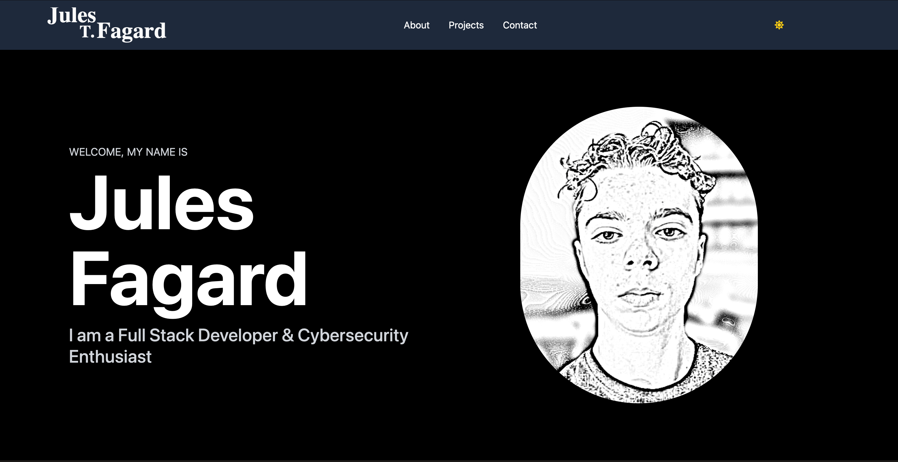

<h2 align="center">
  My Portfolio Website<br/>
  <a href="https://jules.tf" target="_blank">jules.tf</a>
</h2>

<div align="center">
  
</div>

<br/>

<center>

[](https://forthebadge.com) &nbsp;
[](https://forthebadge.com) &nbsp;
[](https://forthebadge.com) &nbsp;
<!--  &nbsp;
 -->

</center>


## NOTE

You can fork this repo to modify and make changes of your own. Please give proper credit by linking back to [Julobulo](https://github.com/Julobulo/Portfolio). Thanks!

## Built With

My personal portfolio <a href="https://jules.tf" target="_blank">jules.tf</a> (which by the way stands for Jules T. Fagard) features some of my GitHub projects as well as my resume and technical skills.

This project was built using these technologies:

- React.js
- Node.js
- Express.js
- Tailwind CSS
- VsCode
- Vercel
- Git

## Features

**📖 Single-Page Layout**

**🎨 Styled with Tailwind CSS**

**📱 Fully Responsive Design**

## Getting Started

Clone down this repository. You will need `node.js` and `git` installed globally on your machine.

## 🛠 Installation and Setup Instructions

1. **Installation:**
    ```sh
    npm install
    ```

2. **In the backend directory, you can run:**
    ```sh
    npm run dev
    ```

2. **In the frontend directory, you can run:**
    ```sh
    npm run dev
    ```

Runs the app in the development mode.<br/>
Open [http://localhost:5173](http://localhost:5173) to view it in the browser.<br/>
The page will reload if you make edits.

## Usage Instructions

Open the project folder and navigate to `/src/components/`.<br/>
You will find all the components used, and you can edit your information accordingly.

## Portfolio Breakdown

### 1. Home Page

**Frontend:**
- Built with React.js and styled using Tailwind CSS for a modern and responsive layout.
- Features a hero section with a brief introduction and navigation links to other sections.

**Backend:**
- No backend functionality required for static content.

### 2. About Me

**Frontend:**
- Utilizes React components to display a biography and professional journey.
- Styled with Tailwind CSS for consistency and responsiveness.

**Backend:**
- Static content, no backend processing required.

### 3. Projects

**Frontend:**
- A gallery of my GitHub projects, dynamically rendered using React.
- Tailwind CSS ensures the section is visually appealing and mobile-friendly.

**Backend:**
- Fetches project data from the GitHub API using Node.js and Express.js to display the latest projects dynamically.

### 4. Blog

**Frontend:**
- Uses React to create a blog section where I share insights and tutorials.
- Tailwind CSS for styling to keep a consistent look and feel.

**Backend:**
- Node.js and Express.js handle blog post data.
- Uses a MongoDB database to store and retrieve blog posts.

### 5. Contact

**Frontend:**
- A contact form created with React, styled with Tailwind CSS.
- Ensures responsiveness and ease of use across devices.

**Backend:**
- Node.js and Express.js handle form submissions.
- Uses Nodemailer to send form data to my email.

## Show Your Support

Give a ⭐ if you like this website!

<a href="https://www.buymeacoffee.com/yourusername" target="_blank"></a>

---

### LinkedIn Article

**Title: Announcing My New Portfolio: A Comprehensive Showcase of My Web Development Journey**

In the ever-evolving world of web development, having a strong online presence is paramount. I'm excited to introduce my new portfolio, a platform designed to highlight my skills, projects, and professional journey. This portfolio is more than just a website—it's a testament to my growth and commitment to the craft.

### The Vision Behind the Portfolio

The main goal of my portfolio is to provide a central hub where I can display my work, share insights through my blog, and offer tools that can help fellow developers. It's a reflection of my dedication to web development and my continuous pursuit of excellence.

### Key Features

1. **Responsive Design:** Ensures a smooth experience across all devices, whether on desktop or mobile.
2. **Project Gallery:** Showcases my projects with detailed descriptions, images, and links to live demos and source code.
3. **Developer Tools:** Includes useful tools such as a markdown previewer, password generator, lorem ipsum generator, and hash calculator.
4. **Blog:** A space to share my thoughts, tutorials, and insights on the latest web development trends.
5. **Contact Form:** Allows visitors to get in touch with me directly for questions, feedback, or collaboration opportunities.

### Technical Details

The frontend is built with React and styled using Tailwind CSS, providing a modern and visually appealing user interface. The backend, powered by Node.js and Express, handles functionalities like contact form submissions, user authentication, and project management.

### Why This Matters

In web development, staying up-to-date and continuously improving your skills is crucial. This portfolio not only showcases my work but also serves as an example of my ability to create comprehensive, functional, and aesthetically pleasing web applications.

### Looking Forward

The launch of this portfolio is just the beginning. I plan to keep it updated with new projects, tools, and blog posts. My aim is to push the boundaries of what I can achieve and to keep growing as a developer.

### Conclusion

I invite you to explore my portfolio and see firsthand the projects I've worked on and the tools I've developed. Your feedback is invaluable to me. Let's connect and collaborate to create something amazing together.

Thank you for taking the time to read about my new portfolio. Visit [yourportfolio.com](https://yourportfolio.com) to explore, and feel free to connect with me on [LinkedIn](https://linkedin.com/in/yourusername).

---

This README and LinkedIn article should give a comprehensive overview of your portfolio, its features, and how it was built, all while maintaining a clean and engaging presentation.